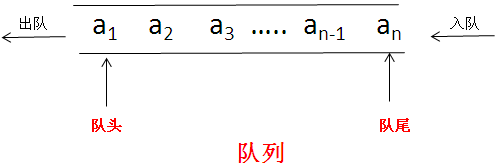

# <font color='red'>线性数据结构</font>

## *数组*
>特性：
>1.存储在物理空间上连续的
>2.底层的数组长度是不可变的
>3.数组的变量，指向了数组第一个元素的位置
>
>优点：
>查询性能好，指定某个元素的位置
>
>缺点：
>1.因为空间必须是连续的，所以如果数组比较大，当系统空间碎片比较多的时候，容易存不下
>2.因为数组长度是固定的，所以数组的内容难以被添加，删除


！当数组内容放满的时候你还想要继续加入，浏览器会进行扩容，先创建一个较长的数组，然后将老数组的内容复制过来，再放入新内容，<font color='red'>消耗cpu性能</font>


！当数组中间一项删除的时候，会将后面的往前补齐，<font color='red'>消耗cpu性能</font>

>*a=[1,2,3,4]*
>*a[1] 方括号表示存储地址的偏移量*
>*操作系统小知识，通过偏移查询数据性能最好*


## *链表*

>特点：
>1.空间上不是连续的
>2.每存放一个值，都要多开销一个引用空间
>
>优点：
>1.只要内存足够大，就能存的下，不用担心空间碎片的问题
>2.链表的添加和删除非常的容易
>
>缺点：
>1.查询速度慢(指查询某个位置)
>2.链表每一个节点都需要创建一个指向next的引用，浪费一些空间，当节点内数据越多，这部分多开销的内存影响越小


！每个链表都是一个对象，包含value，next。next指向下一个数据对象的引用


！想要删除链表当中某一项，只需要把他上一项的next设为他下一项的引用

>**<font color='red'>链表中每一项都认为自己是根节点</font>**
>想要传递一个链表，只需要传递根节点

```js
class node {
  constructor(value) {
    this.value = value
    this.next = null
  }
}

let a = new node(1)
let b = new node(2)
let c = new node(3)
a.next = b
b.next = c

console.log(a.next.value)
console.log(a.next.next.value)
```

## *栈*
>特点：
>栈是一种LIFO（Last-In-First-Out，后进先出）的数据结构，也就是最新添加的项最早被移除。而栈中项的插入（叫做推入）和移除（叫做弹出），只发生在一个位置——栈的顶部。
><font color='red'>后入栈的先出栈</font>


```js
class statck {
  constructor() {
    this.arr = []
  }
  push(a) {
    this.arr.push(a)
  }
  pop() {
    this.arr.pop()
  }
}
let a = new statck
a.push(1)
a.push(2)
a.push(3)
a.push(4)
console.log(a.arr);
a.pop()
console.log(a.arr);
a.pop()
console.log(a.arr);
```

## *队列*
>特点：
>栈数据结构的访问规则是LIFO(后进先出)，而队列数据结构的访问规则是FIFO(Fist-In-First-Out,先进先出)。队列在列表的末端添加项，从列表的前端移除项
><font color='red'>先入队列的先出队列</font>



```js
class duilie {
  constructor() {
    this.arr = []
  }
  push(i) {
    this.arr.push(i)
  }
  shift() {
    this.arr.shift()
  }
}
let a = new duilie
console.log(a);
a.push(1)
a.push(2)
a.push(3)
a.push(4)
console.log(a.arr);
a.shift()
console.log(a.arr);
```

## *双向链表*
>跟单项链表几乎一样
>只不过多了一个引用指向他的上一级
>与单向链表的区别：
>单向链表每个节点认为自己是开头，只知道自己的next指向
>双向链表知道自己的上下级，只要有当中一个节点，就能遍历整个节点树


```js
class lianbiao {
  constructor(value) {
    this.value = value
    this.next = null
    this.pre = null
  }
}

const a = new lianbiao(1)
const b = new lianbiao(2)
const c = new lianbiao(3)
const d = new lianbiao(4)
const e = new lianbiao(5)
console.log(a, b, c, d, e);
a.next = b
b.next = c
b.pre = a
c.next = d
c.pre = b
d.next = e
d.pre = c
e.pre = d
console.log(a, b, c, d, e);
```

# <font color='red'>二维数据结构</font>

## *二维数组*
>多个数组结合
>用于表示表格


```js
const arr = new Array(5)
for (let i = 0; i < arr.length; i++) {
  arr[i] = [1, 2, 3]
}
console.log(arr);
```

## *二维拓补结构*
>链表的集合
>主要展示关系图,不管位置距离等其余因素，单纯只考虑多个对象之间的关系


```js
class tuobu {
  constructor(value) {
    this.value = value
    this.lingjv = []
  }
}

const children = new tuobu('小明')
const father = new tuobu('明爸')
const mather = new tuobu('明妈')

children.lingjv.push(father)
children.lingjv.push(mather)

father.lingjv.push(children)
mather.lingjv.push(mather)
```

## *树形结构--有向无环图*
>数是图的一种
>树形结构的特点：
>1.只有一个根节点
>2.没有回路
>结构:
>根节点：顶级节点
>叶子节点：没有子节点的节点
>树枝节点：不是根，不是叶子的节点是树枝节点
>数的度：节点中叉最多的节点叉的数量就是这棵数的度数
>输的深度：数最深有几层，数的深度就是几,(根节点为1)


## *二叉树——满二叉树*

>定义：
>1.所有节点都在最低层
>2.每个非叶子节点都有且只有两个节点


## *二叉树——完全二叉树*
>国内定义：
>1.叶子节点都在最后两层
>2.所有叶子节点都靠左侧
>国外定义：
>1.叶子节点都在最后两层
>2.如果有子节点，那么必须要有两个子节点


## *子树*
>在二叉树中，每个节点都认为自己是根节点
>子树：二叉树中，每个节点或叶子节点，都是一颗子树的根节点。
>左子树，右子树

对于F而言，C是他的左子树，E是他的右子树


# <font color='red'>算法</font>

# 循环遍历

## *数组*
```js
function ArrEach(arr) {
  if (!arr) return
  for (let i = 0 ; i < arr.length ; i++) {
    console.log(arr[i])
  }
}
```
## *链表*
```js
function ObjEach(obj) {
  if (!obj) return
  console.log(obj.value)
  objEach(obj.next)
}
```

## *二叉树*
>传递二叉树根节点
>前序遍历（先根次序遍历）
>先打印当前的，在打印左边子树，最后打印右边子树
>中序遍历（中根次序遍历）
>先打印左边子树，在打印当前的，最后打印右边子树
>后序遍历（后根次序遍历）
>先打印左边子树，在打印右边子树，最后打印右边子树
><font color='red'>子树也要遵循遍历顺序！！！</font>

```js
// 前序遍历
function beferLog(obj) {
  if (!obj) return
  console.log(obj.value)
  beferLog(obj.left)
  beferLog(obj.right)
}

// 中序遍历
function inTheLog(obj) {
  if (!obj) return
  inTheLog(obj.left)
  console.log(obj.value);
  inTheLog(obj.right)
}

// 后续遍历 
function afterLog(obj) {
  if (!obj) return
  afterLog(obj.left)
  afterLog(obj.right)
  console.log(obj.value);
}
```

# 链表逆置
>**<font color='red'>链表每个节点都认为自己是根节点</font>**


所以我们需要从倒数第二个来操作
循环遍历，查看下个节点的next是否有指向，没有就将其指向自己，并返回下个节点(将作为逆置后的根节点)
如果下个节点的next有指向就将下个节点的指向，将其指向自己，并且让自己的next指向为空,返回遍历后的根节点

```js
function nixu(obj) {
  if (!obj) return 
  if (!obj.next.next) {
    obj.next.next = obj
    return obj.next
  }else {
    const result = nixu(obj.next)
    obj.next.next = obj
    obj.next = null
    return result
  }
} 
```

# 冒泡排序

>原理：比较两个相邻的元素，将值大的元素交换到右边
>
>思路：依次比较相邻的两个数，将满足条件的数放在前面,不满足的数放在后面。


```js
function bubbleSort(arr) {
  for (let i = 0; i < arr.length; i++) {
    for (let j = 0; j < arr.length - 1 - i; j++) {
      if (arr[j] > arr[j+1]) {
        let a = arr[j]
        arr[j] = arr[j+1]
        arr[j+1] = a
      }
    }
  }
}
```

# 选择排序

>首先在未排序序列中找到最小（大）元素，存放到排序序列的起始位置。
>再从剩余未排序元素中继续寻找最小（大）元素，然后放到已排序序列的末尾。
>重复第二步，直到所有元素均排序完毕。


```js
function xuanze(arr) {
  for (let i = 0; i < arr.length - 1; i++) {
    let max = i
    for (let j = i + 1; j < arr.length; j++) {
      if (arr[j] < arr[max]) {
        max = j
      }
    }
    let a = arr[max]
    arr[max] = arr[i]
    arr[i] = a
  }
}
```

# 简单快速排序

>递归：
>1.指定排序数组第一位为标兵
>2.遍历其余其余数组比它大加入right,比它小加入left
>3.将left，right以递归调用排序
>4.最后返回left + leader + right

```js
function sort(arr) {
  if (!arr || arr.length == 0) {
    return []
  }
  let left = [] //站标兵左侧的
  let right = []  //站标兵右侧的
  let leader = arr[0] //标兵
  for (let i = 1; i < arr.length; i++) {
    if (arr[i] > leader) {
      right.push(arr[i])
    }else {
      left.push(arr[i])
    }
  }
  left = sort(left)
  right = sort(right)
  return [...left,leader,...right]
}
```

# 标准快排


```js
function change(arr,start,end) {
  let a = arr[start]
  arr[start] = arr[end]
  arr[end] = a
}

function sort(arr,start,end) {
  if (start >= end - 1) return 
  let left = start
  let right = end 
  do {
    do left++ ; while (left < right && arr[left] < arr[start]);
    do right-- ; while (left < right && arr[right] > arr[start]);
    if (left < right) {
      change(arr,left,right)
    }
  } while (left < right);
  const middle = left === right ? right - 1 : right
  change(arr,start,middle)
  sort(arr,start,middle)
  sort(arr,middle + 1,end)
}
sort(arr,0,arr.length)
```


# 二叉树还原
>已知二叉树的中序加前序或后续可以还原出二叉树
><font color='red'>中序必须知道</font>
><font color='red'>知道前序跟后序无法还原二叉树</font>


## *根据前中序还原二叉树*

```js
function getTwoTree(qian, zhong) {
  if (!qian || !zhong || qian.length !== zhong.length || qian.length === 0 || zhong.length === 0) {
    return null
  }
  const root = new vnode(qian[0])
  const index = zhong.indexOf(root.value)
  let qianLeft = qian.slice(1, index + 1)
  let qianRight = qian.slice(index + 1)
  let zhongLeft = zhong.slice(0, index)
  let zhongRight = zhong.slice(index + 1)
  root.left = getTwoTree(qianLeft, zhongLeft)
  root.right = getTwoTree(qianRight, zhongRight)
  return root
}
```

## *根据后中序还原二叉树*

```js
function getTwoTree(hou, zhong) {
  if (!hou.length || !zhong.length || zhong.length !== hou.length || hou.length === 0 || zhong.length === 0) {
    return null
  }
  const root = new vnode(hou[hou.length - 1])
  const index = zhong.indexOf(root.value)
  const houleft = hou.slice(0, index)
  const houright = hou.slice(index, -1)
  const zhongleft = zhong.slice(0, index)
  const zhongright = zhong.slice(index + 1)
  root.left = getTwoTree(houleft, zhongleft)
  root.right = getTwoTree(houright, zhongright)
  return root
}
```

# 二叉树搜索
><font color='red'>深度优先搜索</font>：适合探索未知
><font color='red'>广度优先搜索</font>：适合探索局域

问？
H在不在二叉树中？
深度搜索顺序：FCADBEHGM
广度搜索顺序：FCEADHGBM


## *深度优先查找*

```js
function treeSearch(vnode, target) {
  if (!vnode) return false
  if (vnode.value === target) return true
  const left = treeSearch(vnode.left, target)
  const right = treeSearch(vnode.right, target)
  return left || right
}
```

## *广度优先查找*

```js
function treeSearch(vnode, target) {
  if (!vnode || vnode.length === 0) return false
  const childrens = []
  for (let i = 0; i < vnode.length; i++) {
    if (!vnode[i]) continue
    if (vnode[i].value === target) return true
    childrens.push(vnode[i].left)
    childrens.push(vnode[i].right)
  }
  return treeSearch(childrens, target)
}
```

# 二叉树比较
>二叉树比较有两种模式：
>1.以二叉树的形式，左右子树不能交换
>2.以拓部结构的形式，可以交换左右子树
><font color='red'>做题的时候一定要问清楚</font>

## *二叉树形式比较*

```js
function contrastTree(node1, node2) {
  if (node1 === node2) return true
  if (!node1 && node2 || node1 && !node2) return false
  if (node1.value !== node2.value) return false
  const left = contrastTree(node1.left, node2.left)
  const right = contrastTree(node1.right, node2.right)
  return left && right
}
```


## *拓部结构形式比较*


```js
function contrastTree(node1, node2) {
  if (node1 === node2) return true
  if (!node1 && node2 || node1 && !node2) return false
  if (node1.value !== node2.value) return false
  return contrastTree(node1.left, node2.left) && contrastTree(node1.right, node2.right) || contrastTree(node1.left, node2.right) && contrastTree(node1.right, node2.left)
}
```

# diff算法
>对比新老两个树形结构，查找两树之间的变化


```js
/**
 * @param {object} old  老树
 * @param {object} now  新树
 * @param {Array} diffList  diff列表 传入空数组
 * 返回：
 * [
 * {type :'新增',old:'null',now:'b'},
 * {type :'删除',old:'a',now:'null'},
 * {type :'修改',old:'a',now:'b'}
 * ]
 */
function diff(old, now, diffList) {
  if (old === now) return diffList
  if (!old && now) {
    diffList.push({ type: '新增', old, now })
  } else if (old && !now) {
    diffList.push({ type: '删除', old, now })
  } else if (old.value !== now.value) {
    diffList.push({
      type: '修改', old, now
    })
    diff(old.left, now.left, diffList)
    diff(old.right, now.right, diffList)
  } else {
    diff(old.left, now.left, diffList)
    diff(old.right, now.right, diffList)
  }
}
```